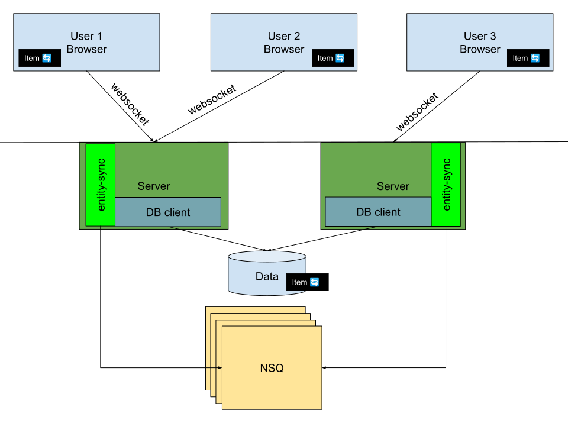

# Entity Sync


&nbsp;<a href="https://codebeat.co/projects/github-com-just1689-entity-sync-master"></a>&nbsp;<a href="https://codeclimate.com/github/just1689/entity-sync/maintainability"></a>&nbsp;
<br />
Want to push entities on change to websocket clients while scaling horizontally? The goal of this library is  to make that easy. Wire Entity Sync into your application and you can keep clients up to date. Each client can subscribe to particular entities. You can change something on one server and all the websocket clients subscribed in the cluster will be pushed the updated entity.   

## Features

- Stateless server. Servers do not need to know about each other or which clients are connected to other servers. This allows the server to scale without synchronizing them.
- When you change something on the server side, provide the EntityKey to the bridge and all clients will be pushed the entity.
- Multiple subscriptions. Each client can subscribe to multiple entities and multiples keys in each entity. 
- Multiple responses. You can send back several rows. This is great if updating the client means sending them rows from tables in foreign keys etc.
- Database / repository agnostic. This library can take a function that you implement to use whichever database, driver, client or interface you choose to implement. 
- A helper package for a simple one call setup (see es/entitysync.go)
- Queue agnostic. Comes with working NSQ integration but you can choose to provide anything you can wrap in `shared.EntityHandler` and `shared.EntityByteHandler`.
- Client secrets. The client can send a secret and when processed you can choose to use the secret to determine identity and authorization for example.
- Function for incoming websocket requests that don't match any concern for this library to pass through.

## Roadmap
- Enable custom websocket listen path.
- Consider improving the security model.
- Consider a different fetch model (fetch per user vs fetch per server).


## Example

### Server setup
Connect the server to EntitySync. Wire the your mux to the bridge and provide a method that can resolve an `EntityKey`.
```go
// Provide a configuration
config := es.Config{
    Mux:     mux.NewRouter(),
    NSQAddr: *nsqAddr,
}
//Setup entitySync with that configuration
entitySync := es.Setup(config)

//Register an entity and tell the library how to fetch and what to write to the client
entitySync.RegisterEntityAndDBHandler(entityType, func(entityKey shared.EntityKey, secret string, handler shared.ByteHandler) {
    item := fetch(entityKey)
    b, _ := json.Marshal(item)
    handler(b)
})

//Start a listener and provide the mux for routes / handling
l, _ = net.Listen("tcp", *listenLocal)
http.Serve(l, config.Mux)
```

### Connect clients
Connect any number of clients:
1. Connect to the server over websocket ws://host:port/ws/entity-sync/
2. Send a subscription request
 
```json
{
    "action": "subscribe",
    "body": {
        "id": "100",
        "entity": "items"
    }
}
```
### Mutate entity & notify

Make some change to the item in question where it is persisted and then call
`bridge.NotifyAllOfChange(entityKey)` where entityKey is a `shared.EntityKey`.

All connected clients over websockets will receive messages for the EntityKey/s to which they are subscribed.


### Sending a secret from the client
```json
{
    "action": "secret",
    "body": "my-super-secret-secret-123"
}
```


## Other examples

### Sending multiple rows to the client
```go
entitySync.RegisterEntityAndDBHandler("report", func(entityKey shared.EntityKey, secret string, handler shared.ByteHandler) {
    item := controller.GetReportByID(entityKey.ID)
    b, _ := json.Marshal(item)
    handler(b)
        
    user := controller.GetUserByID(item.CreatedBy)
    b, _ = json.Marshal(user)
    handler(b)

    department := controller.GetDeparmentByID(item.departmentID)
    b, _ = json.Marshal(department)
    handler(b)
    
})
```

### Checking if a user is allowed to receive the push notification
```go
entitySync.RegisterEntityAndDBHandler("report", func(entityKey shared.EntityKey, secret string, handler shared.ByteHandler) {
    session, err := contoller.GetSessionBySecret(secret)
    if err != nil {
        logrus.Errorln(err)
        return
    }
	
    item := controller.GetReportByID(entityKey.ID)
    b, _ := json.Marshal(item)
    handler(b)
    
})
```

### Provide your own queue
EntitySync is built using NSQ. In theory you can use whatever you like. You will need to provide two functions to the library. The one will allow it to produce a publisher and return a method that will be called to publish. The other is a subscriber and  is provided a method for sending.
```go

var queueAddr = "localhost:4000"

func setup() {
    mux := http.NewServeMux()
    databaseHub := esdb.NewDatabaseHub()
    
    // The bridge matches communication from ws to nsq and from nsq to ws.
    // It also calls on the db to resolve entityKey
    bridge := esbridge.BuildBridge(
        BuildPublisher(queueAddr),
        BuildSubscriber(queueAddr),
        databaseHub.PullDataAndPush,
    )
    
    //Pass the mux and a client builder to the libraries handlers
    esweb.SetupMuxBridge(mux, bridge.ClientBuilder)
    
    ...
}

var BuildPublisher shared.AddressableEntityHandler = func(addr string) shared.EntityHandler {
	return func(entityType shared.EntityType) shared.ByteHandler {
		return func(b []byte) {
			//TODO: setup the publisher client
			...
			qPublisher.publish(entityType.GetQueueName(), b)
		}
	}
}

var BuildSubscriber shared.AddressableEntityByteHandler = func(addr string) shared.EntityByteHandler {
	return func(entityType shared.EntityType, callback shared.ByteHandler) {
		func subscribeNSQ(qAddr string, entityType shared.EntityType, f shared.ByteHandler) {
		}(qArr, entityType, f func(b []byte {
			//TODO: connect to the nats client
			...
			natsHandler(in []byte) {
				f(in)
			}
		}))
	}
}
```

### Pass through ws
You can provide a method that will allow for pass-through handling of websocket messages.
```go
// Provide a configuration
config := es.Config{
    Mux:            mux.NewRouter(),
    NSQAddr:        *nsqAddr,
    WSPassThrough:  func(secret string, b []byte) {
    	//TODO: handle incoming websocket message
    } 
}
//Setup entitySync with that configuration
entitySync := es.Setup(config)

//Register an entity and tell the library how to fetch and what to write to the client
entitySync.RegisterEntityAndDBHandler(entityType, func(entityKey shared.EntityKey, secret string, handler shared.ByteHandler) {
    item := fetch(entityKey)
    b, _ := json.Marshal(item)
    handler(b)
})

//Start a listener and provide the mux for routes / handling
l, _ = net.Listen("tcp", *listenLocal)
http.Serve(l, config.Mux)
```